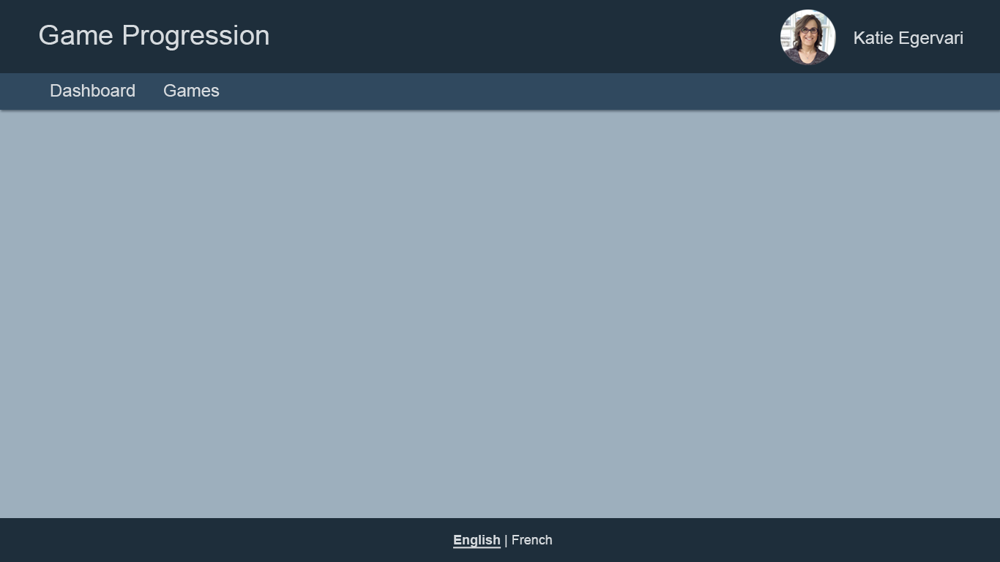
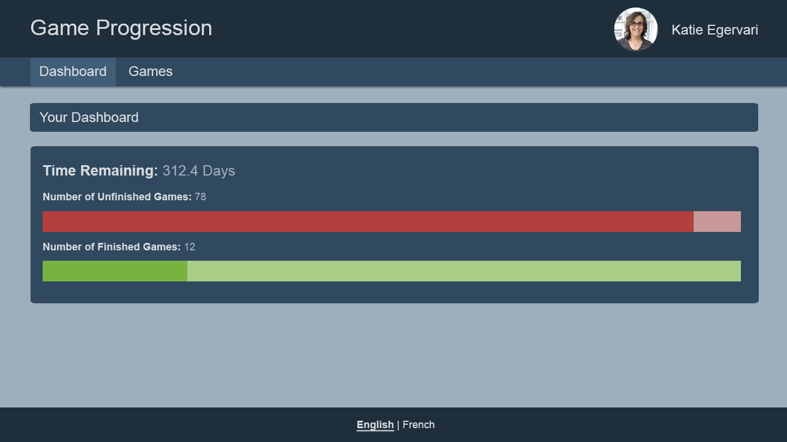
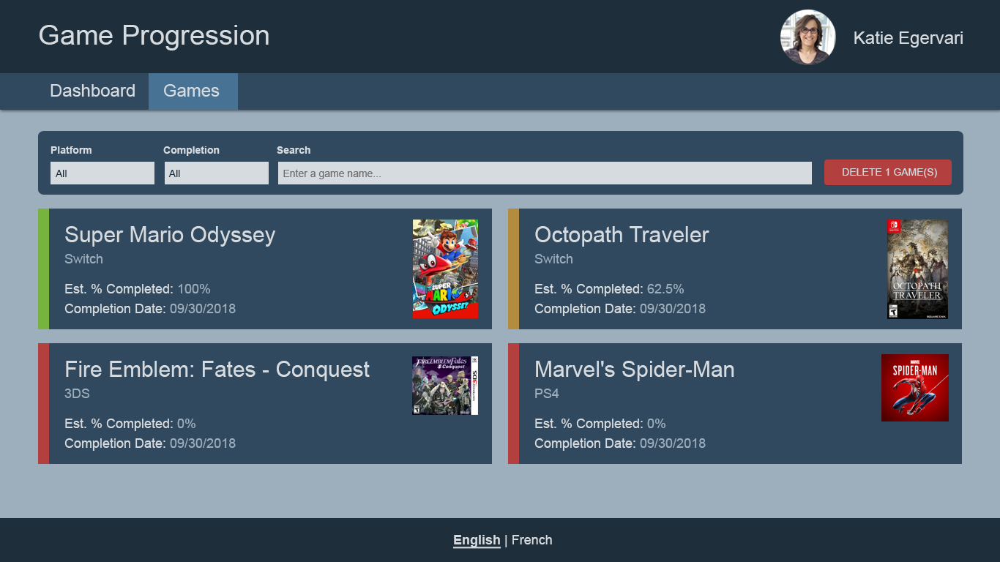
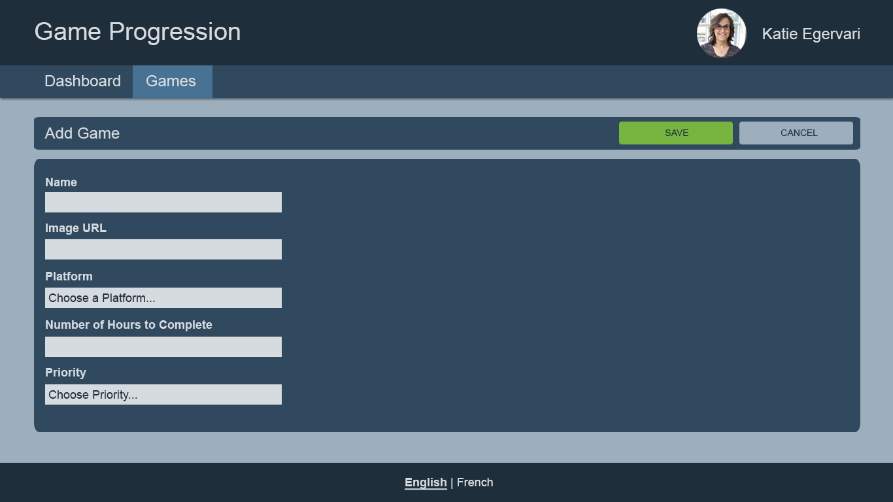
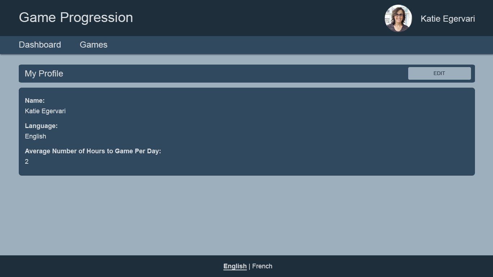
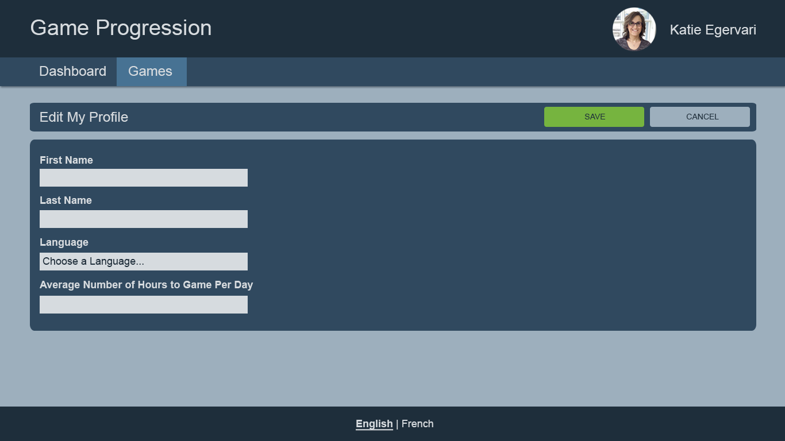

# Video Game Progression Requirements

## The Problem

Katie’s got a big problem... she buys way too many video games she knows she doesn’t have
time to play. But, you know how it is... they’re on sale... and she *must* buy things on sale!
The real travesty is that she’s so busy programming @ Rangle that she never manages to beat
most games. She has a terrible habit of playing a new game and forgetting about the old
one all too quickly. And sometimes so much time has passed, she’ll have to replay games she
already started from the beginning just because she forgot everything! This is incredibly
inefficient, and her backlog of games to play is growing by the month!

Katie needs your help! She’s completely hopeless! She needs a way to catalog her games,
prioritize the games she wants to play most, and keep track of her completion to get caught
up. I will warn you, this journey may be a bit scary and unfamiliar - the road can be
quite termolterous - but the situation is really quite dire and you're the only one who
can help! Do you accept this grand quest?

## Requirements

* All code should be DRY and refactored
* Use @angular/ngrx for state management
  * State should only be placed in the module where it is used - avoid implementing all state
    at the root level
* Use feature-based, hierarchical folder/modules
  * Avoid root-level directories that contain every component and service at the root level.
  * Use componentization to separate concerns and ensure every component does only one
    concept
* Use lazy-loading
* All static content should be translated via ngx-translate
* The site is designed with a screen size of 1366 x 768 in mind. Stick to this resolution.
  * You are not required to implement responsive behaviour.
  * Use SASS to implement styles. Please do not use a tachyons-like library.
* All forms should display error messages per each field and disable the save button until the
  form is valid

### Colors

* **Dark Blue:** #1e2e3b
* **Blue:** #30495f
* **Light Blue:** #9dafbd
* **Text on Dark Background:** #d6dbdf
* **Text on White Background:** #1e2e3b
* **Placeholder Text Color:** #6c6c6c
* **Menu Highlight:** #405e78
* **Green:** #76b43f
* **Light Green:** #a8ce87
* **Red:** #b43f3f
* **Light Red:** #c99898
* **Orange:** #b48c3f

### Layout

* Route: `/`
* APIs Required:
  * `GET /profile`: To retrieve the profile information for the header
  * `GET /languages`: To retrieve the list of languages for the footer
* Unknown routes should go to `/`
* Should have a header, body and footer
* Header
  * The title of the application
  * A my-profile button
  * A menu containing buttons for “Dashboard” and “Games”
    * The menu button should be highlighted if the user is on that page
* Body contains whatever the current route should display
* Footer
  * A way to quickly set your language between English/French
  * The selected is bold and has an underline to indicate its selection
* Any corners of panes that appear rounded should be around 0.25 - 0.5rem
  (use your best judgement), regardless of what my designs actually look like :)
  (*Hint:* Katie is not a designer)

### Dashboard

* Route: `/dashboard`
* APIs Required:
  * `GET /games`: To retrieve the list of games to perform calculations
* If the user goes to `/`, it should redirect to `/dashboard`
* Display the total number of days required for Katie to finish all her uncompleted games
  * Round to 1 decimal place
* Show a progress bar to illustrate the % complete of incomplete games out of the total number of games
  * Be sure to account for partial completion from this overall %
    * % complete of each unfinished game / number of total games
* Show a progress bar to illustrate the % complete of completed games out of the total number of games
  * Since completion is always 100%, it's just simple division
    * number of completed games / number of total games

### Games

* Route: `/games`; `/games/listing`
* APIs Required:
  * `GET /platforms`: To retrieve the list of platforms for the filter
  * `GET /games`: To retrieve the list of games to display the cards
* A card listing of all game entries, showing the following details:
  * If there are no games, display the message, "There are no games in the catalog."
    When implementing this, make use of `[ngSwitch]`.
  * Interactions
    * When hovering over a card, the background color should change and
      the cursor should be set to a pointer
      * The background color change should be a animated CSS transition of 200ms
    * Single-clicking a card will toggle the selection of the card
      * The background of the card change to show that it's been selected and revert to its
        original colour when not selected
    * Double-clicking a card will show a modal dialog to edit the game.
      * Form Fields
        * The number of hours played
          * Required and must a number >= 0
        * The priority to finish the game, from 1 to 10 as selection list
          * Required
        * A checkbox on whether they have beaten the game or not
    * The card listing should be scrollable so that the filters and footer stay on the page.
      * The scrollbar on the cards listing should either be invisible or a subtle effect rather
        than the default browser scrollbar
  * Filters & Sorts
    * Changing any filter/sort value should immediately refresh the results
    * Filter By Platform
      * Select List containing all platforms from REST API
    * Filter By Completion
      * Select List containing 3 static values: All, Complete, Not Complete
    * Sort
      * Select List containing 3 static values: Priority, Completion % or Date Added
      * Default: sorted by Priority
    * Filter By Game name
      * Text Field
      * Debounce should be set to 250ms to prevent lots of API calls
        being made/cancelled as the user types
      * Placeholder Text: "Enter a game name"
  * Actions
    * Button to delete all selected games
    * Displays the number of games that would be deleted
    * Button is disabled if there are no selected games
  * Card Details
    * The game name
    * The image of the game
    * A color indicator about completion somewhere on the card
      * Green for marked as completed.
        * If you want to add a material Icon too: `check_circle`
      * Orange when not completed and game progression is > 0 and <= 100%
        * If you want to add a material Icon too: `play_circle_filled`
      * Red when game is not completed and has 0% completion
        * If you want to add a material Icon too: `access_time`
    * Platform Name
    * Estimated % Complete
      * Note: Estimates cannot exceed 100%.
      * Calculated by hours played / hours to complete
      * Rounded off to 1 decimal place
    * Estimated Completion Date
      * Format: 09/30/2018

#### Add Game

* Route: `/games/add`
* APIs Required:
  * `GET /platforms`: To retrieve the list of platforms for the platform field
  * `POST /games`: To add a new game
* Form Fields
  * Name of game.
    * Required.
  * Image URL
    * Required
    * You don't have to upload an image here
      * I copy image addresses from https://howlongtobeat.com/
  * Choice of Platform
    * Can be a drop-down list or radio buttons - your choice
    * Platforms retrieved from REST
    * Placeholder Text: "Choose a platform..."
  * How many hours to complete game.
    * Required
    * Must be a positive number
    * I grab the values from https://howlongtobeat.com/.
  * Priority between 1 and 10
    * Required
    * Placeholder Text: "Choose a priority..."
  * Also track when the game was added before submitting a POST request. Make sure to save
    in ISO format with timezone information

### Your Profile

* Route `/your-profile`; `/your-profile/details`
* APIs Required:
  * `GET /profile`: To retrieve the profile information
  * `GET /languages`: To retrieve the list of languages to display the correct name
* See Profile Details
  * First and Last name
  * Language
  * Average Number of Hours to game per day
* Edit button to edit these details

#### Edit Your Profile

* Route: `/your-profile/edit`
* APIs Required:
  * `PUT /profile`: To update the profile information
  * `GET /languages`: To retrieve the list of languages for the language field
* Form Fields
  * First and Last name.
    * Required
    * Only alphabet characters
  * Select List or Radio buttons to select English or French as the preferred language
    * Languages retrieved from REST API
    * Placeholder Text: "Choose a language..."
  * Average Number of Hours to game per day
    * Required
    * Must be a number >= 0
  * Save and Cancel buttons
    * If the user presses cancel and the form is dirty (the name, language or hours has
      been modified), show a modal dialog asking confirmation if they want to leave without
      saving changes
